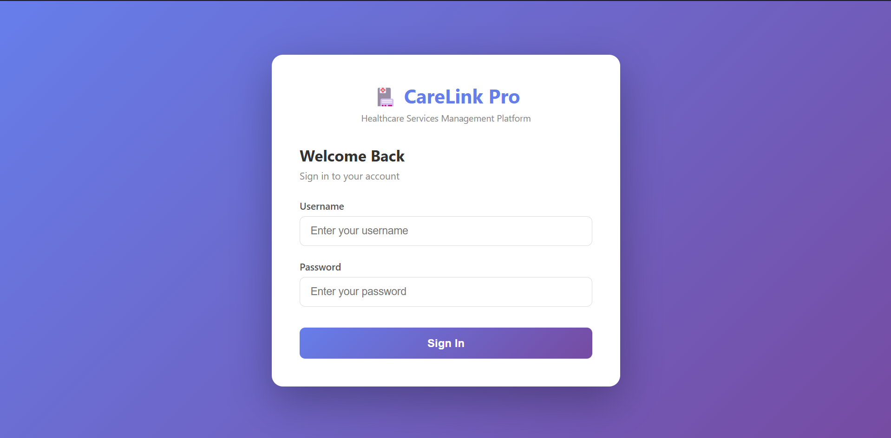
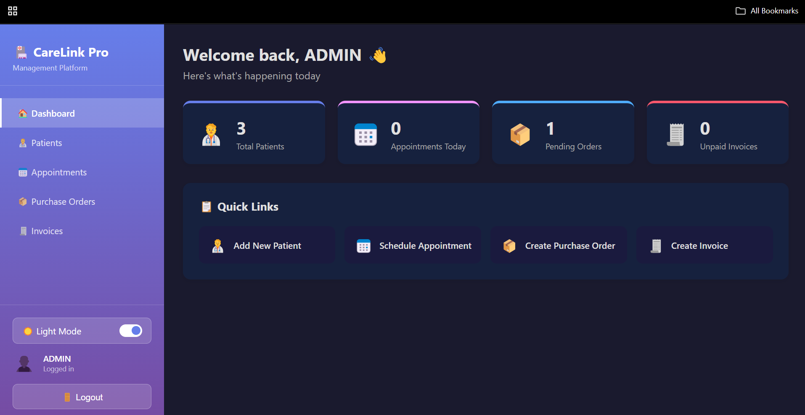
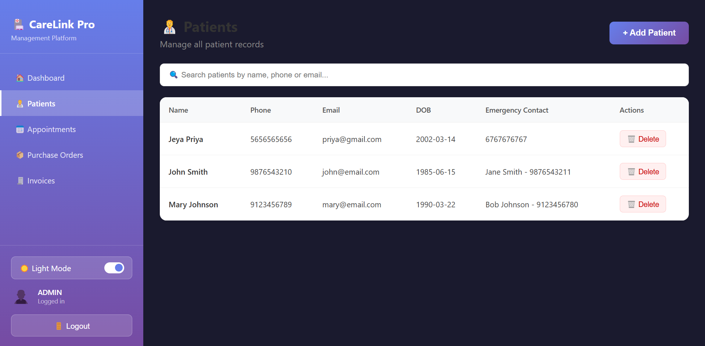
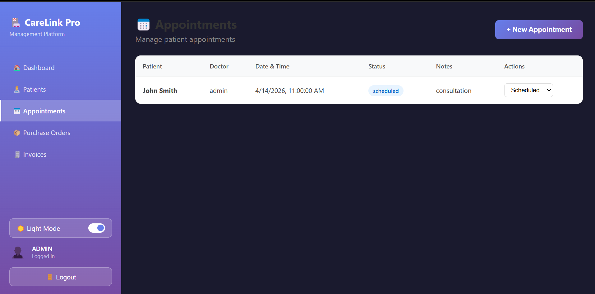
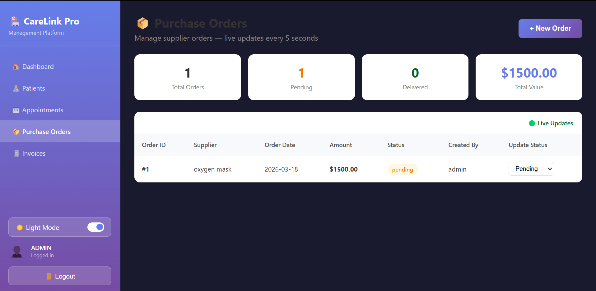
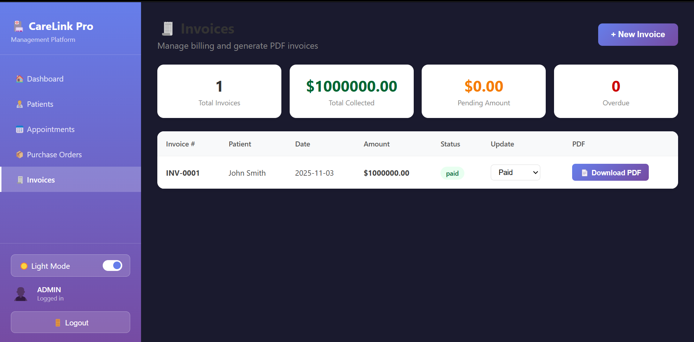

# 🏥 CareLink Pro — Healthcare Management System

A full-stack Healthcare Services Management Platform built with React.js, PHP, and MySQL.


---

## 🚀 Features

- 🔐 JWT Authentication with Role-Based Access Control
- 🧑‍⚕️ Patient Records Management with Search
- 📅 Appointment Scheduling with Status Updates
- 📦 Purchase Order Management with Live AJAX Updates
- 🧾 Invoice Generation with Automated PDF Download
- 🌙 Dark Mode Toggle
- ✔️ Full Form Validation (Frontend + Backend)

---

## 👥 User Roles

| Role | Access |
|------|--------|
| Admin | Full access to all modules |
| Doctor | Patients + Appointments |
| Nurse | Patients + Appointments |
| Receptionist | Patients + Appointments |
| Billing | Orders + Invoices |

---

## 🛠️ Tech Stack

| Layer | Technology |
|-------|-----------|
| Frontend | React.js, React Router, Context API |
| Backend | PHP (REST API) |
| Database | MySQL |
| Authentication | JWT (JSON Web Tokens) |
| PDF Generation | DomPDF |
| Real-time Updates | AJAX Polling |

---

## 📁 Project Structure

carelink-pro/
├── front-end/          # React Application
│   ├── src/
│   │   ├── components/ # Reusable components
│   │   ├── contexts/   # AuthContext, ThemeContext
│   │   ├── pages/      # All page components
│   │   └── services/   # API service layer
│
├── Back-end/           # PHP REST API
│   ├── api/
│   │   ├── auth/       # Login API
│   │   ├── patients/   # Patients CRUD
│   │   ├── appointments/ # Appointments API
│   │   ├── orders/     # Purchase Orders API
│   │   ├── invoices/   # Invoices + PDF API
│   │   └── dashboard/  # Stats API
│   ├── config/         # Database connection
│   ├── middleware/     # JWT Auth middleware
│   └── utils/          # JWT helper

---

## ⚙️ Installation & Setup

### Prerequisites
- XAMPP (Apache + MySQL)
- Node.js + npm
- Composer

### Step 1 — Clone the repository
```bash
git clone https://github.com/Priyapaulraj0014/CareLink.git
```

### Step 2 — Move to XAMPP
Move the project folder to:

### Step 3 — Setup Database
1. Open phpMyAdmin: `http://localhost/phpmyadmin`
2. Create database: `carelink_pro`
3. Import the SQL schema from `database/schema.sql`

### Step 4 — Install PHP Dependencies
```bash
cd Back-end
composer install
```

### Step 5 — Install React Dependencies
```bash
cd front-end
npm install
```

### Step 6 — Start the Application
1. Start Apache + MySQL in XAMPP
2. Run React:
```bash
cd front-end
npm start
```
3. Open browser: `http://localhost:3000`

---

## 🔑 Default Login

| Username | Password | Role |
|----------|----------|------|
| admin | password | Admin |

---

## 📸 Screenshots

### 🔐 Login Page


### 🏠 Dashboard


### 🧑‍⚕️ Patients


### 📅 Appointments


### 📦 Purchase Orders


### 🧾 Invoices


---

## 🙋‍♀️ Author

**Jeya Priya**
- LinkedIn: [Jeya Priya](https://www.linkedin.com/in/jeyapriyacp14/)
- GitHub: [@Priyapaulraj0014](https://github.com/Priyapaulraj0014)

---

## ⭐ Show Your Support

If you found this project helpful, please give it a ⭐ on GitHub!

